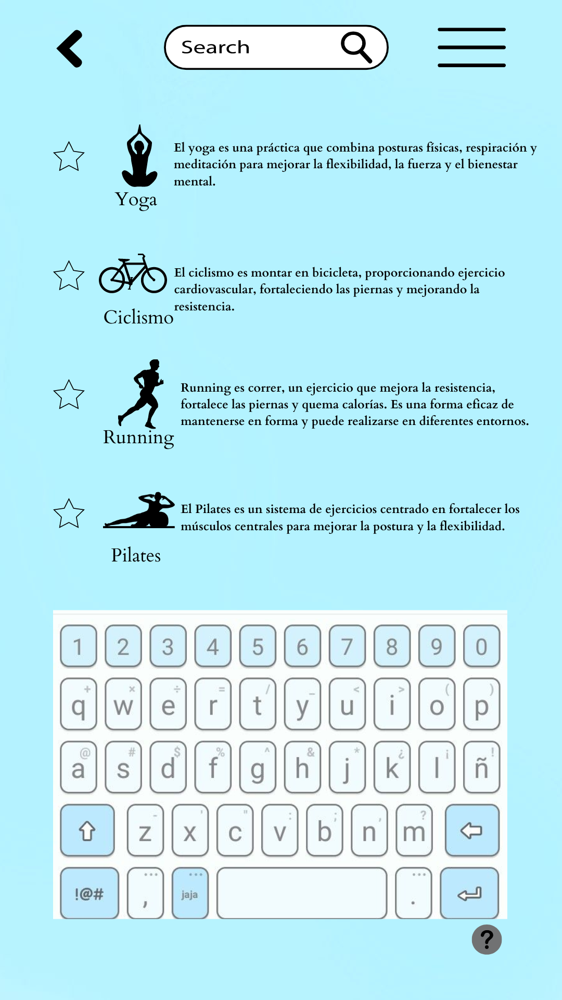
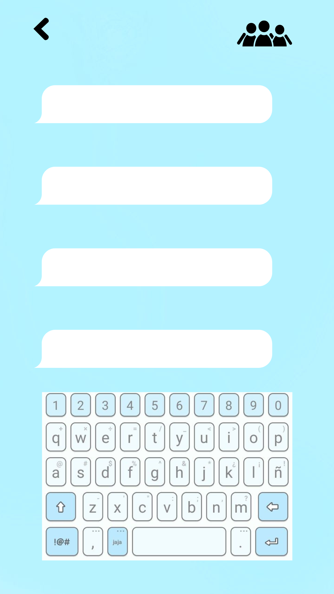

# Diseño de interfaz de usuario

El diseño de la interfaz de MoveMe se inspira en aplicaciones similares centradas en la actividad física. Los diseños fueron creados utilizando [Canva](https://www.canva.com) como herramienta principal.

El diseño completo está disponible en [Figma](https://www.figma.com/proto/tRLICWnWqqgw1HyOx4XF0z/Untitled?type=design&node-id=11-16&t=yGLiqIHpAFfLRmjM-1&scaling=scale-down&page-id=0%3A1&starting-point-node-id=1%3A2&mode=design).

A continuación se muestran las pantallas principales de la aplicación.

**1. Inicio de sesión y registro.**

Cuando el usuario descargue la apliacación esta será la primera pantalla en donde puede registrarse o iniciar sesión en caso de que ya tenga cuenta. 

**2. Selección de tipo de ejercicio**

En esta pantalla la aplicación le da la opción al usuario de ingresar a alguno de los ejercicios propuestos para visualizar el contenido.

**3. Buscador**

Opción de buscador en donde muestra el contenido disponible y definiciones de cada uno. 

**4. Contenido completo del ejercicio seleccionado**

En esta parte el usuario tiene la posibilidad de elegir el video que requiere su rutina, obteiendo recomendaciones y viendo gráficas día a día. 

**5. Contenido programado completado**

Se muestra en la pantalla una gráfica del alcance que tuvo el usuario segun la rutina programada, además de un mensaje motivacional y opcián de comentar lo que opina del video. 

**5. Chat**

Opción de chatear con comunidades dentro de la app. 

 
